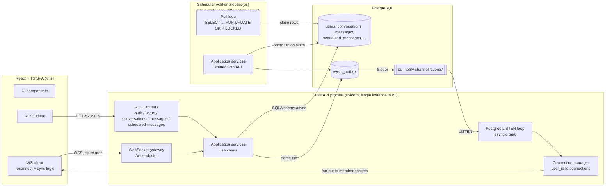
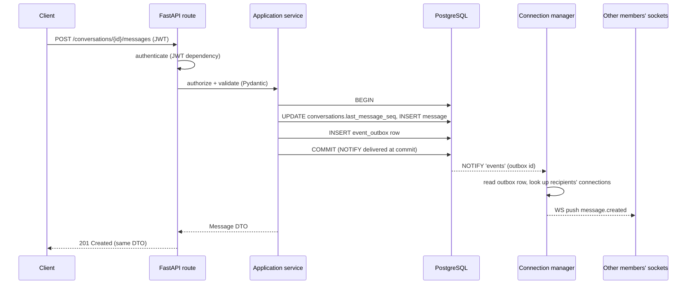
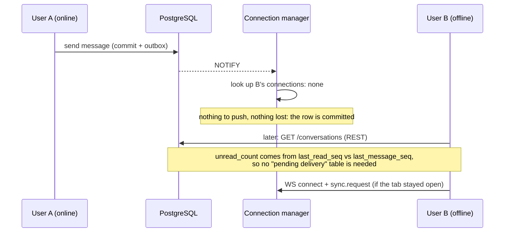
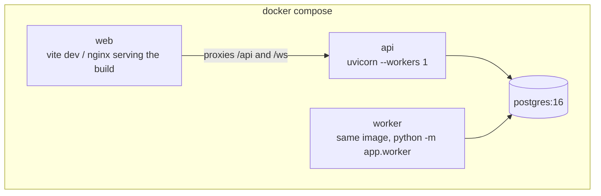

# 4. System High-Level Design

## 4.1 Component diagram

**Why one API process owns all WebSocket connections in v1:** presence and connection state are process-local. A single instance means "is this user online" is a simple in-memory set lookup, and fan-out is a direct in-process dict lookup — no need for a shared presence store. This is [ADR-002](../README.md#adr-002-single-api-instance-first). The `Listener` task exists so that events originating in the **worker process** (scheduled sends) still reach connected clients: the worker commits → Postgres fires `NOTIFY events` → the API's listener task wakes up → reads the new outbox row(s) → hands them to the Connection Manager exactly like an in-process event. This means REST-originated and worker-originated events flow through **one single code path** (outbox → notify → fan-out), which removes an entire class of "worked in testing, missed the worker case" bugs.

## 4.2 Request/event flow — the canonical write path

This is the flow the requirements doc mandates verbatim; every mutating endpoint and the scheduler follow it without exception.

The HTTP response and the WebSocket broadcast are **two independent projections of the same committed row** — the sender gets their own confirmation over REST (works even if their own socket is down), and every member (including other tabs of the sender) gets it over WS. Nothing is ever pushed over WS that wasn't already durably committed.

## 4.3 Sequence: offline receiver

Because unread state is derived from committed rows (`last_message_seq` vs `last_read_seq`), there is no separate "pending delivery" concept to reconcile — reconnecting and calling the ordinary REST endpoints already returns the correct state. The WS sync protocol (§ [08-websocket.md](08-websocket.md)) exists only to backfill the **live event stream** (so the open UI updates without a full refetch), not to determine correctness.

## 4.4 Deployment view (Docker Compose, v1)

`api` and `worker` are the **same Docker image**; only the container command differs (`uvicorn app.main:app` vs `python -m app.worker`). This keeps the codebase single-sourced and avoids duplicated dependency images. See [12-local-dev-docker.md](12-local-dev-docker.md).

## 4.5 Path to multi-instance (documented, not built)

If load requires more than one API instance:
1. Presence moves from an in-memory set to a `presence` row per `(user_id, instance_id)` or a Redis set — first real justification for introducing Redis.
2. `pg_notify`'s ~8KB payload and at-most-once, no-history-if-no-listener semantics become the bottleneck (each instance must independently `LISTEN`, which still works fine for fan-out — every instance gets every NOTIFY — but connection-affinity for a given user's sockets must be tracked so a REST call on instance A can know it needs no local action while instance B holds that user's socket). Because every instance independently listens and re-reads the outbox, this still works **without Redis** up to a moderate number of instances; it only breaks down at a NOTIFY-throughput ceiling, which is the actual trigger for introducing Redis pub/sub or NATS.
3. Rate limiting moves from in-process token buckets to a shared store.
This upgrade path requires no schema changes because the outbox table and `seq` columns are already the shared source of truth — only the delivery mechanism changes.
