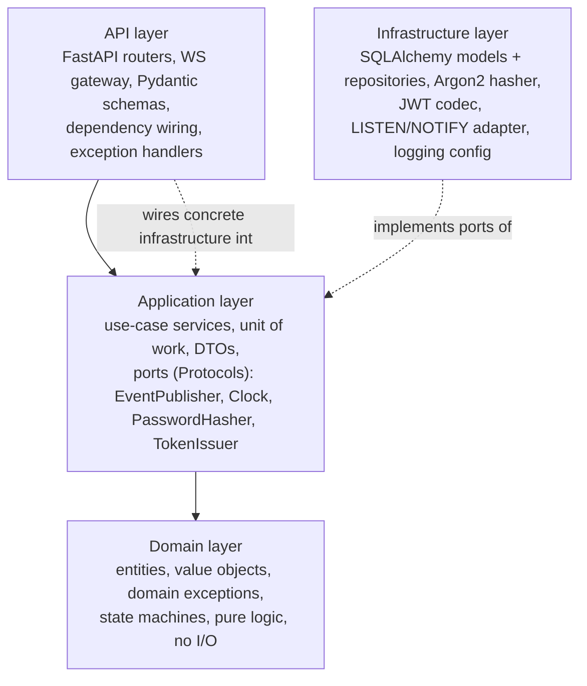

# 5–7. Backend Architecture, Module Boundaries, Directory Structure

## 5. Layered architecture

Practical Clean Architecture — four layers, dependencies point inward only, no interface-per-class ceremony.



**Rule of dependency:** `domain` imports nothing from the other three layers. `application` imports `domain` and defines *ports* (Python `Protocol`s) that `infrastructure` implements — application never imports SQLAlchemy or FastAPI. `api` imports `application` and wires concrete `infrastructure` implementations at startup (composition root in `app/main.py` / `app/container.py`). This is the same mental model as an Express app that keeps `controllers → services → repositories` separate, with the addition that Python's structural typing (`Protocol`) gives interfaces without an explicit `implements` keyword — worth calling out explicitly for a Node developer.

**Avoided over-abstraction:** there is no repository interface for things that only ever have one implementation with no test-double need beyond what an in-memory fake already covers cheaply (e.g. the `Clock` port is a two-line `Protocol` used for deterministic tests, not a heavyweight abstraction). Domain entities are plain dataclasses, not "rich" ORM-entangled objects — SQLAlchemy models are infrastructure-layer, and application-layer DTOs (Pydantic) or domain dataclasses cross the boundary, never ORM instances.

## 6. Module boundaries

| Module (bounded context) | Owns | Does not own |
|---|---|---|
| `identity` | User accounts, credentials, sessions/refresh tokens, WS tickets | Profile display fields beyond auth-critical ones stay here too (single `users` table); presence is a separate module |
| `conversations` | Conversations, membership, DM-uniqueness invariant | Messages themselves |
| `messaging` | Messages, edits, deletes, replies, mentions, read cursors, search | Notification delivery mechanics |
| `presence` | Online/offline state, last-seen, typing (ephemeral) | Message content |
| `notifications` | Notification records, unread notification count | Real-time transport (uses `realtime`) |
| `scheduling` | Scheduled messages, worker claim/execute loop, retry/backoff | Regular message sending (delegates to `messaging` use case) |
| `realtime` | Connection manager, WS gateway, outbox reader/publisher, event envelope | Business rules — it only fans out already-decided events |
| `platform` (cross-cutting) | logging, correlation IDs, config, DB session/UoW, exception hierarchy, rate limiting | — |

Each business module (`identity`, `conversations`, `messaging`, `presence`, `notifications`, `scheduling`) is vertically sliced through all four layers: `modules/<name>/{api,application,domain,infrastructure}`. `platform` and `realtime` are horizontal/shared.

## 7. Directory structure

```
chat-app/
├── docs/                          # this design package
├── docker-compose.yml
├── docker-compose.override.yml    # dev-only overrides (hot reload, exposed ports)
├── backend/
│   ├── pyproject.toml
│   ├── alembic.ini
│   ├── alembic/
│   │   ├── env.py
│   │   └── versions/
│   ├── app/
│   │   ├── main.py                # FastAPI app factory, composition root
│   │   ├── worker.py               # scheduler worker entrypoint (python -m app.worker)
│   │   ├── container.py            # DI wiring: ports -> concrete infra impls
│   │   ├── config.py                # Pydantic Settings (env-driven)
│   │   ├── platform/
│   │   │   ├── logging.py           # stdlib logging (dictConfig, JSON/console formatters), correlation-id contextvar
│   │   │   ├── db.py                 # async engine/session factory, Unit of Work context manager
│   │   │   ├── errors.py             # AppError hierarchy + FastAPI exception handlers
│   │   │   ├── security.py           # PasswordHasher, TokenIssuer ports + Argon2/JWT impls
│   │   │   ├── rate_limit.py          # in-process token-bucket dependency
│   │   │   ├── pagination.py          # keyset pagination helpers
│   │   │   └── middleware.py          # correlation-id + request logging middleware
│   │   ├── realtime/
│   │   │   ├── envelope.py            # WSEvent envelope dataclass
│   │   │   ├── connection_manager.py  # user_id -> connections, fan-out, send-queue backpressure
│   │   │   ├── gateway.py              # /ws route: handshake, ticket auth, recv loop
│   │   │   ├── outbox_listener.py      # asyncpg LISTEN loop -> ConnectionManager
│   │   │   └── publisher.py            # EventPublisher port + Postgres outbox impl
│   │   └── modules/
│   │       ├── identity/
│   │       │   ├── domain/            # User, Credentials, RefreshToken entities; exceptions
│   │       │   ├── application/       # RegisterUser, Login, RefreshAccessToken, Logout, IssueWsTicket
│   │       │   ├── infrastructure/    # SQLAlchemy models + repo, Argon2 adapter
│   │       │   └── api/               # routers, Pydantic schemas, deps (get_current_user)
│   │       ├── conversations/{domain,application,infrastructure,api}/
│   │       ├── messaging/{domain,application,infrastructure,api}/
│   │       ├── presence/{domain,application,infrastructure,api}/
│   │       ├── notifications/{domain,application,infrastructure,api}/
│   │       └── scheduling/{domain,application,infrastructure,api}/
│   └── tests/
│       ├── unit/                      # per-module, domain + application, no DB/network
│       ├── integration/               # real Postgres (testcontainers), repositories, UoW
│       ├── api/                       # httpx.AsyncClient against the app, full stack
│       ├── ws/                        # WebSocket protocol tests
│       └── conftest.py
└── frontend/
    ├── vite.config.ts
    ├── src/
    │   ├── api/                       # REST client (typed, generated or hand-written from OpenAPI)
    │   ├── ws/                        # WS client, reconnect + sync state machine
    │   ├── features/{auth,conversations,messages,presence,scheduled,notifications}/
    │   ├── store/                     # client state (React Query + a small event-driven store)
    │   └── components/
    └── tests/
```

A route file in `modules/messaging/api/routers.py` never imports `modules/messaging/infrastructure/models.py` directly — it depends on `application` services, which are constructed in `container.py` with concrete infrastructure injected. This is the FastAPI analogue of Express's `router → service → repository` layering, made explicit with `Protocol` ports instead of duck-typing hope.

## Python feature → genuine use map (NFR-9)

| Feature | Where it earns its place |
|---|---|
| `Protocol` (structural typing) | Ports: `EventPublisher`, `Clock`, `PasswordHasher`, `TokenIssuer`, `SchedulerRepository` — enables swapping Postgres-outbox for Redis later, and fakes in unit tests, without inheritance ceremony |
| Dataclasses | Domain entities (`Message`, `ScheduledMessage`, `WSEvent`) — immutable-by-default value objects, cheap `__eq__`/`repr` for tests |
| Custom exception hierarchy | `AppError` → `DomainError`/`AuthError`/`NotFoundError`/`ConflictError` → mapped centrally to HTTP status + WS close codes in one place ([10](10-errors-logging-security.md)) |
| Context managers | `UnitOfWork` (`async with uow:` → commit/rollback), worker's per-batch transaction scope, `LogContext` for correlation-id scoping |
| Decorators | `@requires_membership`, `@audit_logged`, `@rate_limited` on route handlers — cross-cutting concerns without repeating them in every handler body |
| Generators / async generators | Keyset-paginated message history iterator (service-layer), WS event replay stream during reconnect sync |
| `async`/`await`, asyncio | Everywhere I/O touches Postgres/WS; the scheduler's poll loop as an `asyncio` task; `asyncio.Queue` per WS connection for backpressure |
| Concurrency primitives | `asyncio.Lock` guarding per-conversation in-process ordering where useful; `SELECT ... FOR UPDATE SKIP LOCKED` for cross-process concurrency |
| Dependency injection | FastAPI's `Depends()` graph; a small `container.py` composition root — contrasted for the reader against Express's manual `req.app.locals` or a DI library |
| `contextvars` | Correlation/request ID and current-user-id threaded through async call stacks into every log line without parameter plumbing |
| Type hints throughout | Pydantic v2 schemas, mypy-checked service signatures — the equivalent "why types matter" lesson a TS developer already has intuition for |

Nothing here is added purely for demonstration — each maps to a real requirement above (see the "genuine purpose" constraint in the spec).
