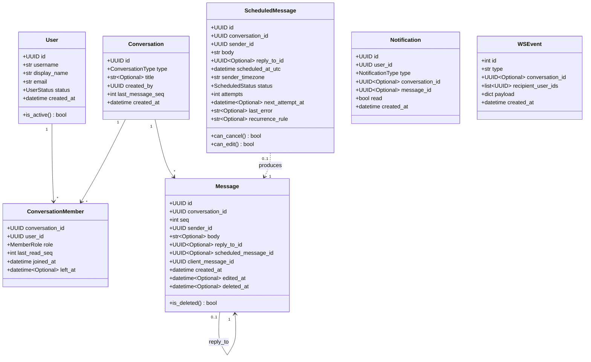

# 8. Domain Model

## 8.1 Core entities (domain dataclasses — infra-free)



Enum values: `ConversationType` = DIRECT | GROUP; `MemberRole` = OWNER | MEMBER; `ScheduledStatus` = PENDING | SENT | CANCELLED | FAILED; `NotificationType` = MENTION | GROUP_ADDED | GROUP_REMOVED | SCHEDULED_FAILED. `WSEvent.id` is the outbox id (global order). `ScheduledMessage.recurrence_rule` is reserved and always null in v1.

## 8.2 Invariants enforced in the domain/application layer (not just DB constraints — checked before hitting the DB where a friendlier error is warranted, and by the DB as the final guard)

- A `DIRECT` conversation has exactly 2 members and is unique per unordered pair (`ConversationDomainError.DuplicateDirectConversation` short-circuits to the existing one instead of creating a duplicate).
- A `GROUP` conversation has a `title` and at least 1 member (the creator, as `OWNER`) at creation; members are added/removed only by an `OWNER` (v1 authorization model — see [06](06-auth-and-authorization.md)).
- A member cannot be added twice (idempotent add: re-adding an already-active member is a no-op, not an error, to keep the UI simple); removing the last `OWNER` from a group is rejected (`ConversationDomainError.CannotRemoveLastOwner`).
- Only the sender may edit/delete a `Message`; a deleted message cannot be edited; editing sets `edited_at` and appends to edit history is **not** kept in v1 (out of scope — noted as a possible future `message_edit_history` table).
- `reply_to_id` must reference a message in the *same* conversation.
- `ScheduledMessage.can_edit()`/`can_cancel()` return `True` only while `status == PENDING`; this is re-checked transactionally at claim time (see [09](09-scheduled-messages.md)) — the domain method exists so the API layer can give a fast, friendly 409 before even attempting the DB round trip, while the DB-level `WHERE status='pending'` remains the actual race guard.
- `Message.seq` is assigned exactly once, monotonically, per conversation — never renumbered, never reused, even after deletion (soft-delete keeps the row).

## 8.3 Exception hierarchy

```
AppError (base, carries `code: str` + `message: str`)
├── DomainError                      # business rule violation -> 422/409
│   ├── ValidationError
│   ├── ConflictError                # e.g. duplicate direct conversation, scheduled msg no longer pending
│   └── InvariantViolation           # e.g. CannotRemoveLastOwner
├── NotFoundError                    # -> 404
├── AuthenticationError              # -> 401 (bad credentials, expired/invalid token, revoked refresh token)
├── AuthorizationError               # -> 403 (not a member, not the sender, not an owner)
└── RateLimitedError                 # -> 429
```

Raised in `domain`/`application`, translated once in a FastAPI exception handler (REST) and once in the WS gateway's dispatch loop (closes with an appropriate code or sends an `error` frame) — never scattered per-route `try/except`. See [10-errors-logging-security.md](10-errors-logging-security.md) for the full mapping table.

## 8.4 Read model note (unread counts, mentions)

`unread_count` and `has_mentions` are **not** stored columns — they are computed at read time from `conversation_members.last_read_seq` vs `conversations.last_message_seq` (and a lightweight `message_mentions` join filtered to `seq > last_read_seq`). This keeps a single writer path (the message-send transaction) and avoids counter-drift bugs; the cost is a cheap indexed range count per conversation per list-request, which is acceptable at this scale and is the same technique Slack's early architecture used before caching layers were justified by scale.
