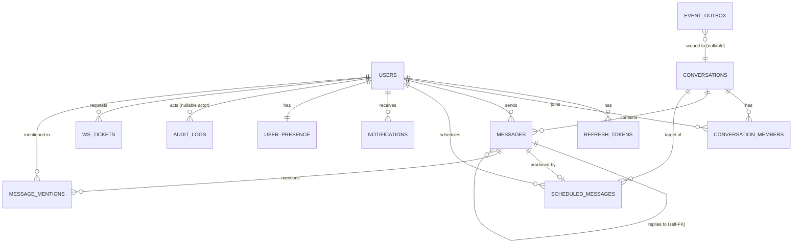

# 9–10. Database ER Design, Indexes and Constraints

## 9.1 ER diagram

`message_reads` from the requirement doc's suggested list is **replaced** by a `last_read_seq` column directly on `conversation_members` (see [ADR-003](../README.md#adr-003-read-cursors-instead-of-per-message-read-rows)); this is called out explicitly since it deviates from the literal list in the spec.

## 9.2 Table definitions

Conventions used throughout: `id UUID PRIMARY KEY DEFAULT gen_random_uuid()` (requires `pgcrypto` extension) unless noted; all timestamps are `timestamptz`, stored and compared in UTC; `created_at TIMESTAMPTZ NOT NULL DEFAULT now()` on every table; soft-delete via nullable `deleted_at` where the row must remain referenceable.

### `users`

| Column | Type | Constraints |
|---|---|---|
| id | UUID | PK |
| username | citext | NOT NULL (unique among non-deleted rows — see partial index) |
| email | citext | NOT NULL (unique among non-deleted rows — see partial index) |
| display_name | text | NOT NULL |
| password_hash | text | NOT NULL |
| status | text | NOT NULL, CHECK IN ('active','disabled'), DEFAULT 'active' |
| timezone | text | NOT NULL DEFAULT 'UTC' — IANA name, e.g. 'Asia/Kolkata' |
| failed_login_attempts | smallint | NOT NULL DEFAULT 0 |
| locked_until | timestamptz | NULL |
| created_at | timestamptz | NOT NULL DEFAULT now() |
| updated_at | timestamptz | NOT NULL DEFAULT now() |
| deleted_at | timestamptz | NULL (soft delete; username/email freed via partial unique index below) |

Indexes: `UNIQUE(username) WHERE deleted_at IS NULL`, `UNIQUE(email) WHERE deleted_at IS NULL`, `GIN ((username::text) gin_trgm_ops)`, `GIN (display_name gin_trgm_ops)` for fuzzy search (`pg_trgm` extension). `pg_trgm` has no operator class for `citext`, so the username index is an expression index on `username::text`, and **search queries must use exactly `username::text`** (for example `username::text ILIKE :pattern`) or the index is not used. `ILIKE` and `similarity()` are already case-insensitive enough for search. `citext` gives case-insensitive uniqueness/lookup for free (no `LOWER()` scattered through queries).

### `refresh_tokens`

| Column | Type | Constraints |
|---|---|---|
| id | UUID | PK |
| user_id | UUID | FK → users(id) ON DELETE CASCADE, NOT NULL |
| family_id | UUID | NOT NULL — shared across a rotation chain, for reuse-detection revocation |
| token_hash | text | UNIQUE, NOT NULL — SHA-256 of the opaque token; raw value never stored |
| issued_at | timestamptz | NOT NULL DEFAULT now() |
| expires_at | timestamptz | NOT NULL |
| revoked_at | timestamptz | NULL |
| replaced_by_id | UUID | FK → refresh_tokens(id) ON DELETE SET NULL, NULL |
| user_agent | text | NULL — best-effort client fingerprint for the sessions UI |
| ip_address | inet | NULL |

Indexes: `INDEX(user_id) WHERE revoked_at IS NULL` (list active sessions fast), `INDEX(family_id)` (revoke whole family on reuse detection). Cascade: deleting a user cascades (hard delete of tokens is fine; tokens carry no independent value once the account is gone).

### `ws_tickets`

Short-lived, single-use tickets that let a browser authenticate a WebSocket handshake without putting a JWT in the URL.

| Column | Type | Constraints |
|---|---|---|
| id | UUID | PK |
| user_id | UUID | FK → users(id) ON DELETE CASCADE, NOT NULL |
| session_family_id | UUID | NOT NULL — `sid` claim of the access token that requested it; binds the socket to a login session |
| ticket_hash | text | UNIQUE, NOT NULL — SHA-256 of the opaque ticket |
| expires_at | timestamptz | NOT NULL — issued_at + 30s |
| consumed_at | timestamptz | NULL |

Index: `INDEX(expires_at)` for a periodic cleanup job (or just rely on it being tiny and short-lived; a daily `DELETE WHERE expires_at < now() - interval '1 day'` cron/worker tick is enough).

### `conversations`

| Column | Type | Constraints |
|---|---|---|
| id | UUID | PK |
| type | text | NOT NULL, CHECK IN ('direct','group') |
| title | text | NULL — NULL for direct; NOT NULL enforced at app layer for group |
| created_by | UUID | FK → users(id) ON DELETE SET NULL, NULL |
| last_message_seq | bigint | NOT NULL DEFAULT 0 — monotonic per-conversation counter, source of message ordering |
| last_activity_at | timestamptz | NOT NULL DEFAULT now() — set at creation; bumped by the message-send transaction in the same `UPDATE` that increments `last_message_seq`. Sorts the conversation list (`last_activity_at DESC, id`) (Q-012) |
| direct_key | text | NULL, UNIQUE — see below |
| created_at | timestamptz | NOT NULL DEFAULT now() |
| updated_at | timestamptz | NOT NULL DEFAULT now() |

**`direct_key`** is the mechanism for "a DIRECT conversation is unique per unordered user pair": on creation of a direct conversation the app computes `direct_key = LEAST(user_a, user_b) || ':' || GREATEST(user_a, user_b)` and relies on the `UNIQUE` constraint to make concurrent "start DM" races resolve safely — a duplicate insert raises `IntegrityError`, which the application layer catches and re-fetches the existing conversation (`ON CONFLICT DO NOTHING RETURNING` combined with a fallback `SELECT` is the exact SQL pattern; see [13](13-failure-and-concurrency.md)). `direct_key` is NULL for group conversations (a partial unique index `WHERE type='direct'` is used instead of a table-wide unique, since NULL != NULL already makes group rows exempt anyway — documented for clarity, and defends against an app-layer bug in `direct_key` computation for group rows).

### `conversation_members`

| Column | Type | Constraints |
|---|---|---|
| conversation_id | UUID | FK → conversations(id) ON DELETE CASCADE, PK (composite) |
| user_id | UUID | FK → users(id) ON DELETE CASCADE, PK (composite) |
| role | text | NOT NULL, CHECK IN ('owner','member'), DEFAULT 'member' |
| last_read_seq | bigint | NOT NULL DEFAULT 0 |
| notifications_muted | boolean | NOT NULL DEFAULT false |
| joined_at | timestamptz | NOT NULL DEFAULT now() |
| left_at | timestamptz | NULL — soft "removed"/left, row retained for history-authorization checks |

PK: `(conversation_id, user_id)`. Indexes: `INDEX(user_id) WHERE left_at IS NULL` (a user's active conversation list — the single most frequent query in the app), `INDEX(conversation_id) WHERE left_at IS NULL` (member/fan-out lookup). Cascade: removing a conversation removes memberships; removing a user removes their memberships (their messages remain, attributed to a retained user row per soft-delete policy on `users`).

### `messages`

| Column | Type | Constraints |
|---|---|---|
| id | UUID | PK |
| conversation_id | UUID | FK → conversations(id) ON DELETE CASCADE, NOT NULL |
| seq | bigint | NOT NULL — assigned from `conversations.last_message_seq` |
| sender_id | UUID | FK → users(id) ON DELETE SET NULL, NULL (tombstoned sender shows as "deleted user") |
| body | text | NULL — NULL when deleted_at is set (tombstone) |
| reply_to_id | UUID | FK → messages(id) ON DELETE SET NULL, NULL |
| client_message_id | UUID | NOT NULL — client-generated idempotency key |
| scheduled_message_id | UUID | FK → scheduled_messages(id) ON DELETE SET NULL, NULL, UNIQUE |
| search_vector | tsvector | GENERATED ALWAYS AS (to_tsvector('english', coalesce(body,''))) STORED |
| created_at | timestamptz | NOT NULL DEFAULT now() |
| edited_at | timestamptz | NULL |
| deleted_at | timestamptz | NULL |

Constraints/indexes:
- `UNIQUE (conversation_id, seq)` — the ordering contract; also the mechanism that makes concurrent sends in one conversation serialize safely (see below).
- `UNIQUE (sender_id, client_message_id)` — idempotent send: a retried POST with the same key returns the original row instead of creating a duplicate.
- `UNIQUE (scheduled_message_id)` — the hard guard against a scheduled message ever being materialized twice.
- `INDEX (conversation_id, seq DESC)` — history pagination (keyset: `WHERE conversation_id = $1 AND seq < :before_seq ORDER BY seq DESC LIMIT :n`), and the basis for unread counting (`seq > last_read_seq`).
- `GIN (search_vector)` — full-text search, scoped to `conversation_id IN (caller's memberships)` at the application layer.
- `INDEX (reply_to_id) WHERE reply_to_id IS NOT NULL`.

**Assigning `seq` safely under concurrency:** `UPDATE conversations SET last_message_seq = last_message_seq + 1 WHERE id = :cid RETURNING last_message_seq`, in the same transaction as the `INSERT INTO messages`. This row-level lock on the `conversations` row serializes concurrent sends **to the same conversation** (acceptable — a single conversation's message order is inherently serial) while sends to *different* conversations proceed fully in parallel (no global lock). This is discussed further in [13](13-failure-and-concurrency.md).

### `message_mentions`

| Column | Type | Constraints |
|---|---|---|
| message_id | UUID | FK → messages(id) ON DELETE CASCADE, PK (composite) |
| mentioned_user_id | UUID | FK → users(id) ON DELETE CASCADE, PK (composite) |

Indexes: `INDEX(mentioned_user_id)` (a user's "messages that mention me"), plus it's joined against `messages.seq > conversation_members.last_read_seq` to compute "unread mentions" without a separate counter.

### `scheduled_messages`

| Column | Type | Constraints |
|---|---|---|
| id | UUID | PK |
| conversation_id | UUID | FK → conversations(id) ON DELETE CASCADE, NOT NULL |
| sender_id | UUID | FK → users(id) ON DELETE CASCADE, NOT NULL |
| body | text | NOT NULL |
| reply_to_id | UUID | FK → messages(id) ON DELETE SET NULL, NULL |
| client_message_id | UUID | NOT NULL, UNIQUE — reused as the eventual `messages.client_message_id` at send time, giving idempotency an unbroken chain from creation through delivery |
| scheduled_at_utc | timestamptz | NOT NULL — normalized to UTC at write time |
| sender_timezone | text | NOT NULL — IANA name captured for display ("scheduled for 6:00 PM your time") |
| status | text | NOT NULL, CHECK IN ('pending','sent','cancelled','failed'), DEFAULT 'pending' |
| attempts | smallint | NOT NULL DEFAULT 0 |
| next_attempt_at | timestamptz | NOT NULL — set by the application to `scheduled_at_utc` on create/edit (Postgres defaults cannot reference other columns); advanced on retry backoff; drives claim ordering |
| last_error | text | NULL |
| recurrence_rule | text | NULL — reserved for future recurrence (RFC 5545 RRULE string); always NULL in v1 |
| created_at | timestamptz | NOT NULL DEFAULT now() |
| updated_at | timestamptz | NOT NULL DEFAULT now() |
| sent_at | timestamptz | NULL — set by the worker in the delivery transaction |
| cancelled_at | timestamptz | NULL |

Indexes:
- `INDEX (status, next_attempt_at) WHERE status = 'pending'` — the exact index the scheduler's claim query needs (partial index keeps it tiny regardless of history size).
- `INDEX (sender_id) WHERE status = 'pending'` — "my scheduled messages" list.
- `UNIQUE(client_message_id)`.

No `version`/optimistic-lock column is needed because claiming uses pessimistic `SELECT ... FOR UPDATE SKIP LOCKED` (see [09](09-scheduled-messages.md)), not optimistic concurrency.

### `notifications`

| Column | Type | Constraints |
|---|---|---|
| id | UUID | PK |
| user_id | UUID | FK → users(id) ON DELETE CASCADE, NOT NULL |
| type | text | NOT NULL, CHECK IN ('mention','group_added','group_removed','scheduled_failed') |
| conversation_id | UUID | FK → conversations(id) ON DELETE CASCADE, NULL |
| message_id | UUID | FK → messages(id) ON DELETE CASCADE, NULL |
| payload | jsonb | NOT NULL DEFAULT '{}' — small denormalized bits for display (e.g. actor name) so the notification feed doesn't need N+1 joins |
| read_at | timestamptz | NULL |
| created_at | timestamptz | NOT NULL DEFAULT now() |

Indexes: `INDEX(user_id, created_at DESC)`, `INDEX(user_id) WHERE read_at IS NULL` (unread notification badge count).

### `user_presence`

| Column | Type | Constraints |
|---|---|---|
| user_id | UUID | PK, FK → users(id) ON DELETE CASCADE |
| status | text | NOT NULL, CHECK IN ('online','offline'), DEFAULT 'offline' |
| last_seen_at | timestamptz | NOT NULL DEFAULT now() |
| updated_at | timestamptz | NOT NULL DEFAULT now() |

One row per user, upserted on connect/disconnect transitions. This table is a **cache of the in-memory connection-manager state**, persisted only so `last_seen_at` survives restarts and so REST clients can read presence without a WS round trip; it is not the authority for "is currently connected" while the process is up (the in-memory `ConnectionManager` is, since it can't lag behind a crash the way a persisted flip could — see [13](13-failure-and-concurrency.md) for the reconciliation-on-startup rule: all rows are forced to `offline` on API boot).

### `event_outbox`

The transactional outbox that makes "commit → publish" atomic and gives every client a durable, replayable event stream.

| Column | Type | Constraints |
|---|---|---|
| id | bigserial | PK — global monotonic order, this **is** the client's `last_event_id` cursor |
| type | text | NOT NULL — e.g. 'message.created' |
| conversation_id | UUID | FK → conversations(id) ON DELETE SET NULL, NULL (NULL for user-scoped events like notifications) |
| recipient_user_ids | UUID[] | NOT NULL — precomputed at write time from membership, so replay never needs a membership join against possibly-changed-since state |
| payload | jsonb | NOT NULL |
| created_at | timestamptz | NOT NULL DEFAULT now() |

Indexes: `INDEX USING GIN (recipient_user_ids)` (used for per-user replay on reconnect: `WHERE id > :after_id AND :user_id = ANY(recipient_user_ids)`), `INDEX(created_at)` for retention pruning. A `AFTER INSERT` trigger issues `pg_notify('events', NEW.id::text)` — the payload of the NOTIFY is intentionally just the id (NOTIFY payloads are capped ~8000 bytes; the listener re-reads the full row from the table). **Retention:** a daily cleanup (run from the worker process) deletes rows older than 7 days; this bounds table growth since the outbox is a transient relay, not permanent history (permanent history lives in `messages` etc.).

### `audit_logs`

Append-only record of security-relevant and administrative events (login success/failure, token revocation, group membership changes, scheduled-message failures).

| Column | Type | Constraints |
|---|---|---|
| id | bigserial | PK |
| actor_user_id | UUID | FK → users(id) ON DELETE SET NULL, NULL (NULL for system/worker actions) |
| action | text | NOT NULL — e.g. 'auth.login_failed', 'conversation.member_removed' |
| target_type | text | NULL — e.g. 'user', 'conversation' |
| target_id | UUID | NULL |
| metadata | jsonb | NOT NULL DEFAULT '{}' — never contains secrets/tokens/passwords (enforced by code review + a redaction helper) |
| ip_address | inet | NULL |
| created_at | timestamptz | NOT NULL DEFAULT now() |

Index: `INDEX(actor_user_id, created_at DESC)`, `INDEX(action, created_at DESC)`. No updates/deletes in application code (append-only by convention; a DB role-level `REVOKE UPDATE, DELETE` is a nice-to-have hardening step noted in [10](10-errors-logging-security.md)).

**Circular FK note:** `messages.scheduled_message_id → scheduled_messages` and `scheduled_messages.reply_to_id → messages` form a cycle. The migration creates both tables first, then adds the two FKs with `ALTER TABLE ... ADD CONSTRAINT` — standard for Alembic, but a common first-migration stumbling block worth flagging for the implementer.

## 9.3 Cascade behavior summary

| Parent deleted | Effect |
|---|---|
| `users` (hard delete — rare/admin-only in v1; normal "delete account" is soft via `deleted_at`) | cascades: `refresh_tokens`, `ws_tickets`, `conversation_members`, `notifications`; `messages.sender_id` → SET NULL (history preserved); `scheduled_messages` cascades (pending ones for a deleted user make no sense to keep) |
| `conversations` | cascades: `conversation_members`, `messages`, `scheduled_messages`; `event_outbox.conversation_id` → SET NULL |
| `messages` | cascades: `message_mentions`, `notifications` referencing it; `messages.reply_to_id` (children) → SET NULL; `scheduled_messages.reply_to_id` → SET NULL |

## 9.4 Extensions required

`pgcrypto` (gen_random_uuid), `citext` (case-insensitive text), `pg_trgm` (fuzzy user search), all enabled in the first Alembic migration.
