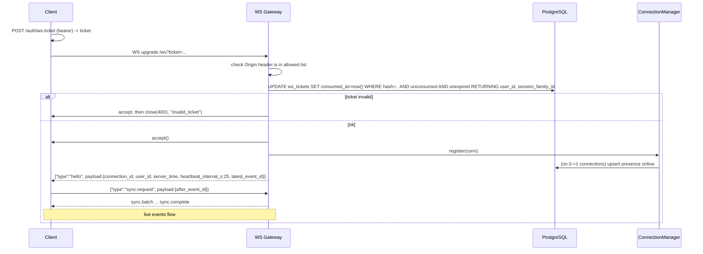

# 14–15. WebSocket Architecture and Event Contracts

## 14. WebSocket Architecture

### 14.1 Principles

1. **WS is delivery only.** A client→server WS frame never mutates durable state. Sending, editing and deleting messages, moving read cursors, and managing scheduled messages all go through REST. WS client frames exist only for ephemeral signals (typing, heartbeat) and for the sync protocol. This gives each operation one validation, authorization and idempotency path instead of two.
2. **Server-computed fan-out.** Clients never subscribe to conversations. Recipients are computed from `conversation_members` when the event is written to the outbox (`recipient_user_ids`), so a client can't receive events for a conversation it isn't in, and there is no subscribe/unsubscribe state to keep in sync.
3. **Every durable event has a global id, so the client can resume.** Ephemeral events (typing, presence) have `id: null` and are never replayed.
4. **At-least-once delivery with idempotent clients.** Events can be delivered twice, for example live and then again during sync. Clients deduplicate by event `id` and apply entity updates idempotently: the version is `edited_at`/`deleted_at`, and message order comes from `seq`.

### 14.2 Endpoint and handshake

`GET wss://<host>/ws?ticket=<opaque>` (the dev proxy forwards `/ws` to the API; see [12](12-local-dev-docker.md)).



- **Origin check:** browsers attach `Origin` to WS upgrades, but CORS does **not** protect WebSockets. The gateway rejects origins that aren't in `ALLOWED_ORIGINS`. The ticket already makes cross-site WebSocket hijacking impractical; the Origin check is defense in depth.
- **Why the server accepts before closing on auth failure:** a browser can't see why an HTTP-level rejection of the upgrade happened; it only sees close code 1006. Accepting and then closing with 4001 lets the client tell "re-authenticate" apart from "network problem, retry".

### 14.3 Connection manager

A single object in the API process, created in the FastAPI lifespan and injected into the gateway and the outbox listener.

```
ConnectionManager
  _by_user:    dict[UUID, dict[str, Connection]]     # user_id -> connection_id -> Connection  (multi-tab)
  _by_session: dict[UUID, set[str]]                   # session_family_id -> connection_ids   (for session.revoked)
  _membership_cache: TTL cache conversation_id -> frozenset[user_id]  (typing authz; 60 s TTL, invalidated by member events)

Connection
  id: str (uuid4 hex), user_id, session_family_id
  websocket
  send_queue: asyncio.Queue[str] (maxsize=256)   # already-serialized JSON frames
  sender_task: asyncio.Task                        # drains send_queue -> websocket.send_text
  receiver loop: runs in the gateway handler coroutine
  last_client_frame_at: float (monotonic)
  state: SYNCING | LIVE | CLOSING
  sync_buffer: list[WSEvent]                       # live events that arrive while SYNCING
  rate_limiter: token bucket (20 frames/s)
```

**Backpressure:** fan-out calls `queue.put_nowait(frame)` for each target connection and never awaits a socket write. If a queue is full (the client is too slow or stalled), the connection is closed with **4008 `slow_consumer`**. The client reconnects and syncs, so no events are lost; it just takes the resync path. This way one stuck browser tab can't block delivery to everyone else. This is a real reason to use `asyncio.Queue` and a separate sender task per connection.

**Multi-tab:** each tab is its own `Connection` under the same `user_id`. Every durable event addressed to the user goes to all of that user's connections, including the tab that made the REST call. That tab deduplicates by `client_message_id`/`id` against its optimistic entry. Presence counts connections, so the user is online while any tab is connected.

**Lock-free by design:** the connection manager is mutated only from coroutines on one event loop, with no `await` between reading and writing its dicts. Asyncio's cooperative scheduling therefore makes these operations atomic without a lock. This is a useful point to explain when teaching asyncio versus threads. The one exception is presence transitions, which involve a DB write (an `await`), so they are serialized per user with an `asyncio.Lock` held in a `dict[user_id, Lock]`. Otherwise a fast close→open sequence could persist `offline` after `online`.

### 14.4 Outbox listener (cross-process delivery)

A dedicated asyncpg connection (outside the SQLAlchemy pool, because LISTEN needs a long-lived session) runs `LISTEN events`.

1. The `AFTER INSERT` trigger on `event_outbox` runs `pg_notify('events', NEW.id::text)`. Postgres delivers NOTIFYs **only at commit**, and in commit order. Rolled-back transactions never notify.
2. The listener callback collects ids and, every ≤20 ms or 100 ids (micro-batching), runs `SELECT * FROM event_outbox WHERE id = ANY($1) ORDER BY id`.
3. For each event, for each `user_id` in `recipient_user_ids`, it hands the event to `ConnectionManager.deliver(user_id, event)`. Users with no local connection are simply skipped; offline delivery is handled by REST state plus sync.
4. **Listener connection loss:** NOTIFYs sent while the listener is disconnected are lost, since Postgres doesn't queue them for absent listeners. On reconnect, the listener therefore sends **`sync.required`** to *every* live connection. Each client runs the normal sync protocol, so there is one recovery mechanism instead of a second, special-case one. `/health/ready` reports 503 while the listener is down.
5. Special internal events are handled by the connection manager and not forwarded as-is: `session.revoked` closes the matching sockets, and `conversation.member_added/removed` invalidates the membership cache.

REST-originated events use this same path; the API process receives its own NOTIFYs. Worker-originated events (scheduled sends) and REST-originated events therefore flow through identical code.

### 14.5 Missed-event synchronization

**The subtle problem: outbox id order ≠ commit order.** `bigserial` values are assigned at *insert* time, not at *commit* time. If transaction T1 inserts event 100 but commits after T2, which inserted and committed event 101, a client that saw 101 and then disconnected would send `after_event_id=101` and miss 100 forever. A naive `id > cursor` replay is incorrect under concurrency.

**v1 solution (simple and bounded):**
1. Every transaction that writes the outbox runs with `SET LOCAL statement_timeout = '5s'`, and the whole DB role has `idle_in_transaction_session_timeout = '10s'`. **No outbox-writing transaction can stay open longer than about 10 s.**
2. The client sends `after_event_id`, the highest id it has applied. The server computes `window_start = (SELECT created_at FROM event_outbox WHERE id = after_event_id) - interval '15 seconds'`. `created_at` is the transaction start time, which is always ≤ commit time. The server then replays `WHERE created_at >= window_start AND :user_id = ANY(recipient_user_ids) ORDER BY id`, which includes a short overlap before the cursor (typically a handful of already-seen events).
3. **The client deduplicates** by keeping a set of the last 2,000 applied event ids. Overlapping events are ignored, and late-committed lower ids are applied.
4. **Per-conversation `seq` gap detection is the backstop for message data.** If a client that has seq 41 for conversation X receives `message.created` with seq 43, it fetches `GET /conversations/X/messages?after_seq=41`. Message history can therefore never silently drift, even if the event stream has a bug.

*Alternative considered:* `pg_current_snapshot()`/`xid8` visibility-horizon filtering gives exact, gap-free cursors. It is noted as the upgrade if the overlap window ever proves insufficient, but it is harder to understand and test for a learning project. See [ADR-005](../README.md#adr-005-outbox-replay-with-overlap-window).

**Protocol:**
- The client sends `sync.request {after_event_id}`. `null` means "first connect, nothing cached": the server replies `sync.complete` immediately, with `latest_event_id`, and the client loads state over REST.
- The server replies with 1..n `sync.batch {events: [...]}` frames (up to 200 events each), followed by `sync.complete {latest_event_id}`.
- While in `SYNCING`, live events for that connection are appended to `sync_buffer`. After `sync.complete` is sent, the buffer is flushed, deduplicated against replayed ids, and the connection switches to `LIVE`. This guarantees nothing arrives in the gap between the replay query and going live.
- **Reset:** if `after_event_id` has already been pruned (older than the 7-day retention, i.e. `< min(id)`), or more than 5,000 events would be replayed, the server sends **`sync.reset_required`**. The client drops its caches and reloads the conversation list and the open conversation over REST. Correctness comes from REST state; replay is only an optimization.

### 14.6 Heartbeat and connection health

- **Protocol-level:** uvicorn's `ws_ping_interval=20` and `ws_ping_timeout=20` clean up dead TCP connections on the server side.
- **App-level (needed because browser JS can't see protocol pings):** the client sends `{"type":"ping"}` every 25 s and the server replies `pong` with `server_time`. The client treats a missing pong within 10 s as a dead connection: it closes and reconnects. The server closes connections with no client frame for 60 s (1001 `idle_timeout`).

### 14.7 Disconnect and reconnect

- **Server side on disconnect:** unregister the connection and cancel its sender task. If this was the user's last connection, start a **10 s presence grace timer**; if no connection returns in that time, persist `offline` with `last_seen_at = now()` and broadcast `presence.updated`. The grace timer keeps page reloads and short network blips from flapping the user's presence for everyone else.
- **Client reconnect policy:** exponential backoff with full jitter (base 0.5 s, factor 2, cap 30 s), reset after 60 s of stable connection. Before each attempt the client gets a fresh ticket. If that fails with 401, it runs a refresh; if the refresh fails, it goes to the login screen.
- **Close code handling:**

| Code | Name | Client behavior |
|---|---|---|
| 1000 | normal | Don't reconnect (the client initiated it, e.g. logout) |
| 1001 | going_away / idle_timeout / server shutdown | Reconnect with jitter |
| 1011 | internal_error | Reconnect with backoff |
| 4000 | bad_frame | Log (bug); reconnect with backoff |
| 4001 | unauthorized / invalid_ticket / session_revoked | Refresh the access token and get a new ticket. If `session_revoked`, go straight to login |
| 4003 | forbidden (repeated unauthorized frames) | Log (client bug); reconnect with backoff |
| 4008 | slow_consumer | Reconnect immediately, then sync |
| 4029 | rate_limited | Reconnect after 10 s |

- **Graceful server shutdown (SIGTERM):** the lifespan's shutdown phase stops accepting connections, sends `close(1001)` to every connection, waits up to 5 s for sender queues to drain, then exits. Presence rows are *not* flipped to offline here. Instead, API startup sets every `user_presence.status` to `offline`, because an API crash wouldn't have run shutdown code anyway. With a single API instance this is correct. For multi-instance, see [02](02-hld.md) §4.5.

### 14.8 Presence and typing routing

- **Presence audience:** users who share at least one active conversation with the subject. The co-member list is computed on a 0↔1 transition with one query (`SELECT DISTINCT m2.user_id FROM conversation_members m1 JOIN conversation_members m2 USING (conversation_id) WHERE m1.user_id=$1 AND both active`), cached for 60 s, and intersected with currently connected users. Presence events are ephemeral: they are sent directly without an outbox write and never replayed. After reconnect, clients get current presence from REST (`/users/presence?ids=`).
- **Typing:**
  - The client sends `typing.start {conversation_id}` when the user starts typing, repeats it every 3 s while they keep typing, and sends `typing.stop` on send, blur, or an empty input.
  - The server checks membership via the TTL cache, throttles to one broadcast per (user, conversation) per 2 s, and sends `typing.updated {is_typing, expires_in_s: 6}` to the *other* members' connections.
  - Receivers auto-expire the indicator after 6 s even if `stop` never arrives (the sender tab crashed). Nothing is written to the DB.

## 15. WebSocket Event Contracts

### 15.1 Envelope

**Server → client**

```json
{
  "v": 1,
  "id": 18234,
  "type": "message.created",
  "conversation_id": "5f0c...",
  "occurred_at": "2026-10-01T12:30:00.123Z",
  "correlation_id": "req_7a9...",
  "payload": { }
}
```

| Field | Notes |
|---|---|
| `v` | Envelope schema version. Additive payload changes don't bump it |
| `id` | Outbox id (bigint, sent as a JSON number, since it stays well within 2^53). **`null` for ephemeral events** (typing, presence, pong, hello, sync control frames) |
| `type` | `<resource>.<verb>` in past tense for facts. Control frames use their own names |
| `conversation_id` | Present for conversation-scoped events, otherwise `null`. Lets the client route events without parsing the payload |
| `occurred_at` | When the source transaction ran, in UTC |
| `correlation_id` | The `request_id` of the REST call that caused the event, or the worker's job correlation id. Used to trace one action across logs and the client |
| `payload` | Type-specific, listed below. For entity events it is the **full current resource** (same schema as REST), not a diff, so a client can apply it without having seen previous events |

**Client → server**

```json
{ "type": "typing.start", "ref": "c-42", "payload": { "conversation_id": "5f0c..." } }
```

`ref` is optional. When present, the server answers with `{"type":"ack","ref":"c-42"}` or `{"type":"error","ref":"c-42","payload":{"code","message"}}`. Unknown `type`s or invalid payloads get an `error` frame. More than 10 invalid frames per minute closes the connection with 4000. Maximum inbound frame size is 16 KB.

### 15.2 Client → server frames

| type | payload | Notes |
|---|---|---|
| `ping` | `{}` | → `pong` |
| `sync.request` | `{after_event_id: int|null}` | See §14.5 |
| `typing.start` | `{conversation_id}` | Membership checked, throttled |
| `typing.stop` | `{conversation_id}` | |

That is deliberately the whole list; see principle 1 in §14.1.

### 15.3 Server → client frames: control

| type | payload |
|---|---|
| `hello` | `{connection_id, user_id, server_time, heartbeat_interval_s, latest_event_id}` |
| `pong` | `{server_time}` |
| `ack` / `error` | see above |
| `sync.batch` | `{events: [Envelope]}` |
| `sync.complete` | `{latest_event_id}` |
| `sync.reset_required` | `{reason: "cursor_expired"|"too_many_events"}` |
| `sync.required` | `{reason: "listener_reconnected"}`. The server asks the client to run `sync.request` now |

### 15.4 Server → client frames: domain events

| type | Durable (`id`) | Recipients | payload |
|---|---|---|---|
| `message.created` | yes | all active members | `Message` (REST schema) |
| `message.updated` | yes | all active members | `Message` (with `edited_at`) |
| `message.deleted` | yes | all active members | `{id, conversation_id, seq, deleted_at}` |
| `conversation.created` | yes | all initial members | `Conversation` |
| `conversation.updated` | yes | all active members | `Conversation` (e.g. title change) |
| `conversation.member_added` | yes | all active members, including the added users | `{conversation: Conversation, members: [Member]}` |
| `conversation.member_removed` | yes | remaining members **plus the removed user** | `{conversation_id, user_id, removed_by}`. The removed user's client drops the conversation from its UI |
| `conversation.read` | yes | **the reader's own** connections | `{conversation_id, last_read_seq, unread_count, unread_mention_count}`. Keeps badges in sync across tabs |
| `receipt.updated` | yes | other members (direct and small groups only) | `{conversation_id, user_id, last_read_seq}` |
| `notification.created` | yes | the notified user | `Notification` |
| `scheduled_message.sent` | yes | sender's connections | `{scheduled_message: ScheduledMessage, message_id}`. The matching `message.created` goes to all members separately |
| `scheduled_message.failed` | yes | sender's connections | `ScheduledMessage` (with `last_error`) |
| `scheduled_message.updated` | yes | sender's connections | `ScheduledMessage`. Covers create, edit, cancel and retry, so the scheduled list stays in sync across the sender's tabs |
| `presence.updated` | **no** | co-members who are connected | `{user_id, status: "online"|"offline", last_seen_at}` |
| `typing.updated` | **no** | other connected members | `{conversation_id, user_id, is_typing, expires_in_s}` |
| `session.revoked` | internal | — | Handled by the connection manager (close 4001), never forwarded as a frame |

### 15.5 Scenario walkthroughs (event level)

- **Normal message, both online:** A POSTs → 201 over REST. Both A's other tabs and B's tabs receive `message.created`. B's client increments unread if that conversation isn't focused, or else PUTs the read cursor, which produces `conversation.read` for B's tabs and `receipt.updated` for A.
- **Receiver viewing another conversation:** B receives `message.created` for conversation X while looking at Y. The client increments X's badge locally, from `seq` compared with the last read seq it knows. If the message mentions B, B also receives `notification.created` and the client shows a toast. The unread count stays authoritative on the server; the next `GET /conversations` or `conversation.read` corrects any drift.
- **Offline receiver:** no socket, so nothing is delivered. On login, B's `GET /conversations` shows `unread_count`. On a *reconnect* (tab still open), sync replays any missed `message.created` events.
- **Group chat:** one outbox row with N recipient ids, delivered to every connected member's connections. The cost is one DB row, not N.
