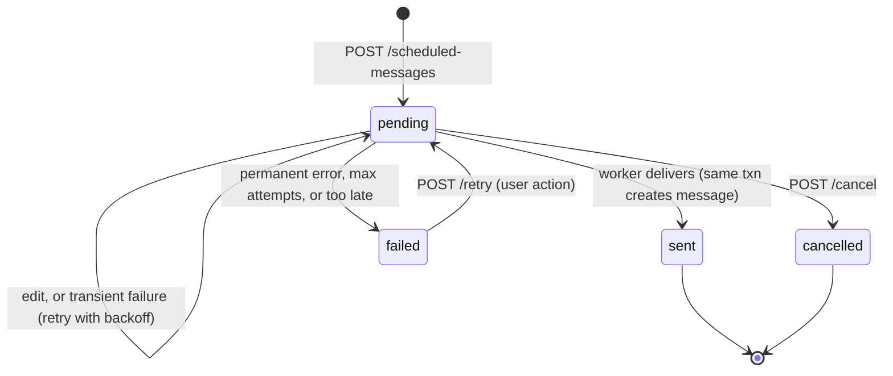

# 16–17. Scheduled-Message Architecture and Background Processing

## 16. Scheduled-message architecture

### 16.1 Decision: Postgres-backed polling worker, no queue framework

| Option | Verdict |
|---|---|
| In-process `asyncio` timer per message (`call_later`) | **Rejected.** Timers are lost on restart, and they duplicate if more than one API process ever runs. It fails two of the explicit requirements. |
| APScheduler with a SQLAlchemy job store | **Rejected.** It adds a second persistence model (its own job table) that must be kept consistent with `scheduled_messages`. Its multi-process locking story is weaker than doing it ourselves, and it hides exactly the concepts this project is meant to teach. |
| Celery/RQ + Redis with ETA tasks | **Rejected for v1** (see ADR-001). It is new infrastructure, ETA tasks for far-future times are a known Celery weakness (they are held in worker memory), and the job would *still* need a DB-level idempotency guard. It adds cost without removing the hard part. |
| **Separate worker process polling `scheduled_messages` with `FOR UPDATE SKIP LOCKED`** | **Chosen.** The table *is* the queue, so there is one source of truth. It survives restarts by construction. Any number of workers can run concurrently without double-claiming, and it uses plain SQL that can be tested directly. |

`SKIP LOCKED` exists specifically for queue-like tables: concurrent claimers skip rows another transaction has locked instead of blocking on them. That gives safe, contention-free work distribution across N workers.

### 16.2 State machine



There is **no `processing` state**. A row being worked on is held under a row lock inside the worker's open transaction, and the lock itself is the "in progress" marker. If the worker crashes, Postgres drops the connection, the transaction rolls back and the lock is released. The row is still `pending` and simply gets claimed again on the next poll. A `processing` status would need a lease or timeout mechanism to recover rows stuck by a crashed worker. We avoid that entirely because delivery is short, DB-only work: no external HTTP calls happen while the lock is held.

### 16.3 Time handling

- The API accepts only **offset-qualified** timestamps (`2026-10-01T18:00:00+05:30`). A naive datetime → `422 naive_datetime`.
- The instant is converted to UTC and stored as `scheduled_at_utc timestamptz`. `sender_timezone` (IANA name) is stored separately, for display and for future recurrence rules, where it is required: "every day at 09:00 Asia/Kolkata" must be expanded in wall-clock time, or DST shifts the delivery time in zones that observe DST.
- All comparisons happen in the database with `now()`, never with application-server time, so clock skew between the API and worker containers can't cause early or late sends. The `Clock` port exists for domain-level validations (the "at least 30 s in the future" check) and is faked in tests.
- Python's side uses `datetime` values that are always timezone-aware, and `zoneinfo.ZoneInfo` for IANA validation. A lint or test rule forbids `datetime.utcnow()` and naive `datetime.now()`.

### 16.4 API-side operations and their race guards

All three are single conditional statements, so the database resolves the race; there is no read-then-write in application code.

| Operation | SQL shape | Race behavior against a worker currently holding the row lock |
|---|---|---|
| Edit | `UPDATE scheduled_messages SET body=…, scheduled_at_utc=…, next_attempt_at=…, updated_at=now() WHERE id=:id AND sender_id=:me AND status='pending' RETURNING *` | The UPDATE **blocks** on the row lock until the worker commits. Under READ COMMITTED, Postgres then re-evaluates the `WHERE` against the new row version, finds `status='sent'`, updates 0 rows, and the API returns **409 `not_pending`**. The user's edit never "half-applies" to an already-sent message. |
| Cancel | `UPDATE … SET status='cancelled', cancelled_at=now() WHERE id=:id AND sender_id=:me AND status='pending' RETURNING *` | Same: it either cancels before the worker claims, in which case the worker's claim query no longer matches the row, or it waits and gets 409. If the row is already `cancelled`, the service returns 200 (idempotent). |
| Create | `INSERT … ON CONFLICT (client_message_id) DO NOTHING RETURNING *`, falling back to a SELECT | A double-submit returns the original row. |

If the edit wins the race instead and moves `scheduled_at` into the future, the worker's claim query (`next_attempt_at <= now()`) won't match it on the next poll. That is also correct.

## 17. Background processing

### 17.1 Worker process

Entrypoint: `python -m app.worker`, the same image and codebase as the API. It starts:

1. **Scheduled-message loop** (the main job).
2. **Housekeeping loops**, each guarded by `pg_try_advisory_lock(<job-key>)` so only one worker instance runs each one even with N workers:
   - `event_outbox` retention: delete rows older than 7 days, in batches of 5,000.
   - `ws_tickets` cleanup: delete rows past `expires_at + 1 day`.
   - `refresh_tokens` cleanup: delete rows expired for more than 30 days.
   - Each runs every 10 min (tickets) or hourly (the others).
3. A **heartbeat**: it touches `/tmp/worker-heartbeat` every 10 s, and the compose healthcheck checks the file's age.

Multiple worker replicas are supported and safe (`docker compose up --scale worker=3`). One worker is enough for v1 load.

### 17.2 Scheduled-message loop

```
loop:
    async with uow() as tx:                                  # one transaction per batch
        rows = SELECT * FROM scheduled_messages
               WHERE status = 'pending' AND next_attempt_at <= now()
               ORDER BY next_attempt_at
               LIMIT :batch_size (default 20)
               FOR UPDATE SKIP LOCKED
        for row in rows:
            async with tx.savepoint():                       # SAVEPOINT per item
                outcome = await deliver(row, tx)             # see 17.3
            record outcome on row (sent / retry scheduled / failed), still inside the txn
        COMMIT                                               # releases locks, fires pg_notify for outbox rows
    if len(rows) == batch_size: continue immediately (drain backlog)
    else: sleep(poll_interval = 2 s, interruptible by shutdown event)
```

- **Why a savepoint per item:** a failure delivering item 3 (for example an IntegrityError) must not roll back items 1–2, which have already succeeded in the same transaction. `async with tx.savepoint()` is a nested context manager around `session.begin_nested()`, a real use of context-manager composition. After rolling back to the savepoint, the outer transaction still holds item 3's row lock, so the worker can safely record `attempts += 1` / `last_error` / `next_attempt_at` on it before commit.
- **Why batch at all:** it gives one round trip per 20 rows instead of one per row during a backlog, such as after a restart when many messages became due. The small batch keeps lock hold times, and therefore edit and cancel wait times, well under a second.
- **Poll interval of 2 s:** delivery precision is about ±2 s, which is fine for chat. The claim query hits the partial index `(status, next_attempt_at) WHERE status='pending'`, so an idle poll costs microseconds. A LISTEN-based wake-up for "due within the next poll interval" was considered and rejected, because the extra complexity isn't worth less than 2 s of precision.

### 17.3 `deliver(row)`: exactly-once effect

`deliver` does **not** reimplement sending. It calls the same application function the REST endpoint uses, `MessagingService.create_message(tx, sender_id, conversation_id, body, reply_to_id, client_message_id, scheduled_message_id)`. That function assigns `seq`, parses mentions, creates mention notifications, and writes the `message.created` and `notification.created` outbox events. The scheduled path and the interactive path therefore can't diverge.

Steps, all inside the item's savepoint:
1. **Re-validate** against current state rather than the state at scheduling time:
   - the sender is still `active`
   - the sender is still an active member of the conversation
   - `reply_to_id`, if set, is still in the same conversation; if the target was hard-deleted the FK has already set it to NULL, so the message is sent without a reply reference
   - lateness: `now() - scheduled_at_utc ≤ SCHEDULE_MAX_LATENESS` (default 24 h)
2. `create_message(...)`. The **`UNIQUE(scheduled_message_id)`** constraint on `messages`, together with `client_message_id` carried over from the scheduled row, makes a second materialization impossible even under a bug.
3. `UPDATE scheduled_messages SET status='sent', attempts=attempts+1, sent_at=now(), updated_at=now()`. The produced message is found through `messages.scheduled_message_id`, so the link isn't stored twice.
4. Write the `scheduled_message.sent` outbox event, addressed to the sender.
5. Write `audit_logs 'scheduled_message.sent'`.

All of this commits atomically together with the message, so the requirement's six steps (validate, create, persist, mark sent, publish, notify) are **one transaction**. The WS publication happens on commit through the outbox trigger and NOTIFY. There is no window in which the message exists but the scheduled row still says `pending`, or the other way round.

### 17.4 Failure classification and retry

| Error | Class | Handling |
|---|---|---|
| Sender no longer a member / sender disabled / conversation deleted | **Permanent** | `status='failed'`, `last_error='sender_not_member'` etc. Create a `scheduled_failed` notification and a `scheduled_message.failed` event for the sender. Audit. |
| Overdue beyond `SCHEDULE_MAX_LATENESS` (for example, the system was down for 2 days) | **Permanent** (policy) | `failed`, `last_error='expired'`. A reminder sent days late in a chat is usually worse than a clear "this didn't go out", and the user can use `POST /retry`. |
| `IntegrityError` on `UNIQUE(scheduled_message_id)` | **Already done** | This should be impossible under row locking, but if it happens the message already exists. Mark `sent` (the existing message is already linked through `messages.scheduled_message_id`) and log a WARNING. This is idempotent recovery, not a failure. |
| `OperationalError` / `DBAPIError` (deadlock, serialization failure, statement timeout) | **Transient** | `attempts += 1`, `next_attempt_at = now() + backoff(attempts)`, `last_error` = the exception class name (never the full message, which may contain data). |
| Any other unexpected exception | **Transient, up to the limit** | Same as transient, and logged at ERROR with the stack trace. After `SCHEDULE_MAX_ATTEMPTS` (default 5) it becomes `failed` with `last_error='max_attempts_exceeded'`. |
| Worker crash mid-batch (the process is killed) | Not visible to the code | The transaction rolls back and the rows are still `pending` with unchanged attempts, so they are reclaimed by the next poll or another worker. **Known limitation:** a message that deterministically kills the process (not just raises) would retry forever without `attempts` increasing. That is accepted as practically impossible for DB-only work, and noted in [13](13-failure-and-concurrency.md). |

`backoff(n) = min(10 s × 2^(n−1), 15 min) × uniform(0.8, 1.2)`. The jitter stops a burst of failures from retrying in lockstep.

Application restart is covered by design: all state is in `scheduled_messages`, so on startup the loop just claims whatever is due, including anything that became due while the system was down. That backlog drains in batches.

### 17.5 Observability

Every log line from the worker carries `worker_id` (hostname plus pid) and a per-batch `batch_id` correlation id. The batch id is also written as `correlation_id` on the outbox events it creates, which ties a scheduled delivery to its WS events.

| Event | Level | Fields |
|---|---|---|
| `scheduler.batch_claimed` | DEBUG (INFO if > 0 rows) | `claimed`, `batch_id` |
| `scheduler.message_sent` | INFO | `scheduled_message_id`, `message_id`, `conversation_id`, `attempt`, `lateness_ms`, `duration_ms` |
| `scheduler.message_retry` | WARNING | `scheduled_message_id`, `attempt`, `error_class`, `next_attempt_at` |
| `scheduler.message_failed` | ERROR | `scheduled_message_id`, `reason`, `attempts` |
| `scheduler.stats` (every 60 s) | INFO | `pending_total`, `due_now`, `oldest_due_lag_s`, the key "is the scheduler keeping up" signal |
| `scheduler.started` / `stopping` / `stopped` | INFO | `worker_id`, `poll_interval`, `batch_size` |

Message bodies are **never** logged (they're user content). Only ids and lengths appear.

### 17.6 Graceful shutdown

On SIGTERM the worker sets an `asyncio.Event`. The loop finishes and commits the in-flight batch (bounded by the 5 s statement timeout), does not start a new one, stops the housekeeping tasks, and exits 0. Compose `stop_grace_period: 15s`.

### 17.7 Evolution paths

**Recurring messages (next feature):**
1. Populate `recurrence_rule` (an RRULE string, expanded with `dateutil.rrule` in `sender_timezone`).
2. Add a `scheduled_message_runs(id, scheduled_message_id, occurrence_at_utc, message_id, status)` table with **`UNIQUE(scheduled_message_id, occurrence_at_utc)`**, and move the exactly-once guard from `messages.scheduled_message_id` to it. `messages.scheduled_message_id` loses its UNIQUE constraint, which becomes a migration step.
3. On a successful send, a recurring row stays `pending`, and `next_attempt_at` is set to the next occurrence computed in wall-clock time in the sender's time zone. One-time rows keep going to `sent`.

The claim loop, locking, retry and state machine don't change, which is the point of the current shape.

**Moving to a queue (only if needed):** the seam is the use case `ExecuteScheduledMessage(scheduled_message_id)`. A Celery beat or ETA task, or a Redis sorted-set poller, could invoke it. The use case would still take the row lock with `SELECT … FOR UPDATE` (without SKIP LOCKED) and still depend on `UNIQUE(scheduled_message_id)`. That keeps idempotency in the database, where queue at-least-once redelivery can't break it. Triggers for the move would be: more than about 1k deliveries per second sustained, or a need to fan out work to non-Python consumers.
