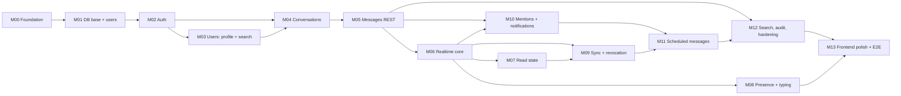

# 25. Development Milestones

Each milestone is **vertically complete**: migration, domain, application, API, tests and the minimal frontend for it, and it leaves `main` in a working, demoable state. The detail for each milestone (Goal, Dependencies, Files/modules, DB, API, WS, Tests, Acceptance criteria) is in [../milestones/](../milestones/).

## Dependency graph

## Summary

| # | Milestone | Headline outcome | Main learning focus |
|---|---|---|---|
| [M00](../milestones/M00-foundation.md) | Foundation | Compose stack boots; `/health` works; JSON logs carry a request id; CI is green | Project layout, `pydantic-settings`, `logging.dictConfig`, `contextvars`, ASGI middleware |
| [M01](../milestones/M01-database-base.md) | DB base | Alembic + roles + extensions + `users`; UoW; test DB fixtures | SQLAlchemy 2.x async, Alembic, context managers, pytest fixtures |
| [M02](../milestones/M02-auth.md) | Auth | Register/login/refresh/logout with rotation and reuse detection; lockout; rate limit | Argon2, JWT, `asyncio.to_thread`, custom exceptions, FastAPI `Depends`, decorators |
| [M03](../milestones/M03-users.md) | Users | Profile read/update, user search (trigram) | Pydantic partial updates, `pg_trgm`, cursor pagination |
| [M04](../milestones/M04-conversations.md) | Conversations | DMs (race-safe), groups, add/remove members, list | `ON CONFLICT`, row locks, authorization dependencies |
| [M05](../milestones/M05-messages.md) | Messages (REST) | Send/edit/delete/reply/history with `seq` + idempotency | Keyset pagination, async generators, concurrency-safe counters |
| [M06](../milestones/M06-realtime-core.md) | Realtime core | Outbox + NOTIFY + listener + WS gateway + fan-out; live messages in the UI | asyncio tasks and queues, WebSockets, LISTEN/NOTIFY, Protocol ports |
| [M07](../milestones/M07-read-state.md) | Read state | Read cursors, unread counts, receipts, multi-tab badge sync | Derived read models, idempotent PUT |
| [M08](../milestones/M08-presence-typing.md) | Presence + typing | Online/offline/last-seen with grace; typing indicators | `asyncio.Lock`, timers, ephemeral vs durable events |
| [M09](../milestones/M09-sync-and-revocation.md) | Sync + revocation | Reconnect replay with overlap and dedup, reset, `sync.required`, session-bound sockets | Commit-order subtleties, state machines (client and server) |
| [M10](../milestones/M10-mentions-notifications.md) | Mentions + notifications | `@mentions` parsed on the server, notification feed and events | Regex, generators, denormalized payloads |
| [M11](../milestones/M11-scheduled-messages.md) | Scheduled messages | Full CRUD + worker with SKIP LOCKED, retries, housekeeping | Background processing, savepoints, advisory locks, time zones, graceful shutdown |
| [M12](../milestones/M12-search-audit-hardening.md) | Search + audit + hardening | Full-text search; audit coverage; redaction test; security headers; OpenAPI snapshot | `tsvector`/GIN, security review discipline |
| [M13](../milestones/M13-frontend-polish-e2e.md) | Frontend polish + E2E | Loading/empty/error states, accessibility pass, Playwright smoke | E2E testing across processes |

**Critical path:** M00 → M01 → M02 → M04 → M05 → M06 → M09 → M11. M03, M07, M08, M10 and M12 can be reordered or done in parallel once their dependencies are met.

**Where frontend work fits:** from M02 onward, every milestone includes the minimal UI needed to demo it. Visual polish is deferred to M13, so backend learning stays the main focus.
